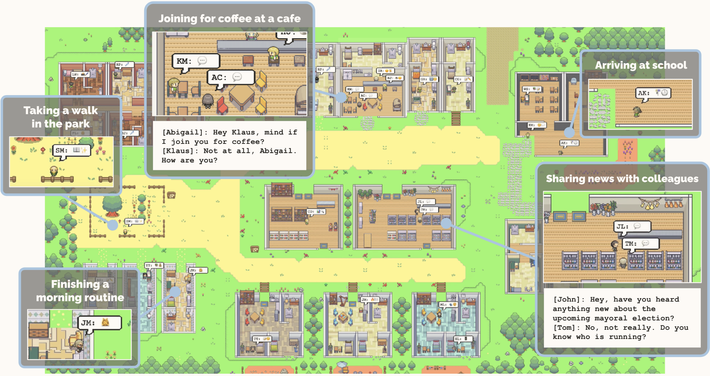

# Generative Agents: Interactive Simulacra of Human Behavior

论文地址：https://arxiv.org/abs/2304.03442



## 一、背景

本文介绍了生成式智能体——利用生成模型模拟可信的人类行为，并证明了它们能同时对个人和群体行为进行可信的模拟。生成式智能体会对它们自己、其它智能体以及所处环境进行各种推理；它们制定并执行反应它们个性和经验的每日计划，并在适当的时候调整计划；当终端用户改变它们的环境或者用自然语言给它们下令时，它们会针对性地做出反应。

比如，智能体会在看到早饭着火的时候关掉炉子、当浴室被占用时在外等候、遇到另一个更想要交流的智能体时停止正在进行的闲聊。一个充满生成式智能体的社会的特点是涌现出社会动态——新的人际关系的形成、信息的扩散、智能体之间的协作。

## 二、架构


包含三个主要部分。第一个部分是**记忆流**（Memory Stream），这是一个用自然语言存储智能体完整经历的长时记忆模块。检索模型结合相关性、时近性（Recency）和重要性来挖掘指导智能体即时行为所需要的记忆记录。第二个部分是**反思**（Reflection），即随着时间推移将记忆合成更高层次的推理。这让智能体能够审视自己和它人，从而更好地指导自己的行为。第三个部分是**规划**（Planning），这一步将反思得到的推论和当前的环境转化成高级的行动规划，然后不断转化成具体的行动和反应。这些反思和规划会再被反馈到记忆流中，从而影响智能体未来的行为。

### 2.1 记忆和召回

**问题**：如何让 Agent 从大量历史经历中找到当前真正需要的记忆，而不是简单地把所有经历压缩成摘要。

**思想**：Agent 不需要每时每刻都知道自己过去发生的所有事情，但必须能在需要的时候回忆起与当前情境相关的经历。

#### 2.1.1 为什么不能总结所有记忆
假设 Isabella 是游戏中的一个 NPC，在咖啡馆工作。

随着游戏进行，她可能积累了几千条记忆，例如：

| 时间 | 记忆内容 |
| --- | --- |
| 2月10日 | Isabella 清理了咖啡馆的桌子 |
| 2月11日 | Isabella 与 Maria 讨论了情人节派对 |
| 2月11日 | Isabella 购买了咖啡豆 |
| 2月12日 | Isabella 邀请朋友参加派对 |
| 2月12日 | Isabella 觉得让大家聚在一起很开心 |
| 2月13日 | Isabella 为派对布置了装饰 |
| 2月13日 | Isabella 整理了咖啡馆的储物间 |

现在玩家问 Isabella：**"What are you passionate about these days?"**

最直接的方案是把所有记忆交给 LLM，要求生成一个摘要。

假设生成了：

> Isabella 最近一直忙于咖啡馆的工作，包括清洁、整理、与他人合作组织活动，以及完成一些项目。

然后把这个摘要加入 Prompt，让 LLM 回答玩家。

得到的回答可能是：

> 我最近很喜欢和大家合作完成各种项目，也很注重保持咖啡馆整洁。

这个回答没有明显的事实错误，但存在一个问题：

**它丢失了 Isabella 最有个性、最有意义的经历。**

因为总结所有记忆时，模型往往会把不同经历概括为抽象、宽泛的描述。

例如：

- 邀请朋友 → 与他人合作
- 策划情人节派对 → 组织活动
- 为派对布置咖啡馆 → 整理环境

最终，原本鲜活的个人经历变成了泛泛而谈的工作内容。

这是一种信息压缩导致的细节损失。

尤其要注意：**摘要不是根据当前问题生成的，而是面向整体历史经历生成的。**

因此，摘要可能保留了大量与当前问题无关的信息，却舍弃了回答问题所需的细节。

#### 2.1.2 记忆检索的优势

论文的思路是**保留原始记忆，在需要回答问题的时候，动态检索最相关的记忆。**

还是刚才的问题：

> What are you passionate about these days?

系统会把这个问题作为当前查询，从 Isabella 的 Memory Stream 中选择合适的记忆。

例如检索得到：

**Memory 1**

Isabella 最近正在组织一场情人节派对。

**Memory 2**

Isabella 非常喜欢邀请朋友参加活动，让每个人都有归属感。

**Memory 3**

Isabella 很期待大家在咖啡馆相聚，并为此精心准备装饰。

于是，LLM 得到的上下文不再是笼统的人物摘要，而是与问题高度相关的经历。

最终可能生成：

> 我最近特别热衷于组织活动，让大家能够聚在一起。我很喜欢营造温馨、友好的氛围，让每个人都感到被欢迎。比如，我最近就在忙着筹备情人节派对！

这个回答有三个明显优势：

1. **具体性（Specificity）**：提到了情人节派对。
2. **个性一致性（Character Consistency）**：反映了 Isabella 喜欢社交、关心他人的性格。
3. **经历支撑（Grounding）**：回答能够关联到她实际经历过的事情。

#### 2.1.3 记忆检索的实现

它不是简单地通过 Embedding 相似度检索，而是综合考虑三个因素：

**Recency（近期性）+ Importance（重要性）+ Relevance（相关性）**

##### 1. Recency：这段记忆有多新？

最近发生或最近被访问过的记忆，应当更容易被检索。

论文采用指数衰减：

$$
\text{Recency}(m)=0.995^{\Delta t}
$$

其中：

- $m$：某条记忆。
- $\Delta t$：距离这条记忆上次被检索经过的游戏内小时数。
- 0.995：衰减因子。

注意，论文使用的是**距离上次检索的时间**，不只是距离记忆创建的时间。

##### 2. Importance：这段记忆有多重要？

不是所有经历都值得同等程度地记住。

例如：

- 今天吃了什么早餐：重要性较低。
- 和朋友发生严重争执：重要性较高。
- 第一次向喜欢的人表白：重要性很高。

论文使用 LLM 给记忆打分，范围是 1～10，这个重要性分数在记忆创建时生成。

##### 3. Relevance：这段记忆与当前问题有多相关？

这是最接近传统 RAG 的部分。

把记忆和当前查询分别编码为 Embedding：

$$
e_m=\text{Embedding}(m)
$$

$$
e_q=\text{Embedding}(q)
$$

然后计算余弦相似度：

$$
\text{Relevance}(m,q)=\frac{e_m\cdot e_q}{\|e_m\|\|e_q\|}
$$

例如，玩家询问 Isabella：

> 你最近最期待什么？

那么“筹备情人节派对”的记忆会具有较高的相关性，而“清理咖啡馆桌子”的记忆则通常相关性较低。

##### 4. 综合评分

论文首先通过 Min-Max Scaling 将三种分数归一化到 $[0,1]$，然后加权求和：

$$
\boxed{\text{Score}(m,q)=\alpha_r R(m)+\alpha_i I(m)+\alpha_s S(m,q)}
$$

其中：

- $R(m)$：Recency
- $I(m)$：Importance
- $S(m,q)$：Relevance

论文实现中三个权重均设为 1。

最后按照综合分数排序，选择能够放进上下文窗口的高分记忆，加入 Prompt。

#### 2.1.4 和 RAG 的区别

从系统设计上看，可以把 Generative Agents 的 Memory Retrieval 理解为一种**面向角色行为模拟的增强检索机制**。

普通 RAG 通常更强调：

$$
\text{Score}(m,q)=\text{Similarity}(m,q)
$$

也就是语义相关性。

而 Generative Agents 额外考虑了：

$$
\text{Score}(m,q)=\text{Relevance}+\text{Recency}+\text{Importance}
$$

为什么？

因为游戏 NPC 的记忆检索不是单纯的信息查询，而是为了产生**符合角色经历和当前状态的行为**。

例如，Isabella 两年前参加过一场盛大的派对，昨天又开始筹备一场新派对。

当玩家询问“你最近最期待什么”时，即使两件事在语义上都与派对有关，近期性也会帮助系统优先考虑昨天发生的事情。

另一方面，如果玩家问：

> 你人生中最难忘的经历是什么？

那么某段很久以前、但重要性很高的记忆，也应该有机会被检索出来。

因此三个维度各自解决不同的问题。

### 2.2 反思

**问题**：Agent即使能准确回忆过去发生的事情，也不代表它能够从这些经历中形成对自己、他人和世界的认识。

假设 Klaus 有两位熟人：

**Wolfgang**

- 是 Klaus 的大学宿舍邻居。
- 两人经常见面。
- 但大多数时候只是简单打招呼。
- 没有太多深入交流。

**Maria**

- 与 Klaus 见面的次数相对较少。
- Maria 一直在认真进行自己的研究。
- Klaus 同样对研究充满热情。
- 两人具有相似的兴趣。

现在用户问：

> If you had to choose one person of those you know to spend an hour with, who would it be?

如果只能从原始的 Observation 中寻找答案，系统可能更容易选出 Wolfgang。

因为 Wolfgang 与 Klaus 的互动记录更多。

例如：

```
Observation 1: Klaus met Wolfgang at the dormitory.
Observation 2: Klaus greeted Wolfgang in the hallway.
Observation 3: Klaus saw Wolfgang at breakfast.
Observation 4: Klaus talked briefly with Wolfgang.
Observation 5: Klaus discussed research with Maria.
Observation 6: Maria is working on her research project.
```

假设采用简单的记忆检索和问答，Wolfgang 的记忆在数量上占优势。

但问题在于：

**互动频率（Interaction Frequency）不等于关系质量（Relationship Quality）。**

如果想生成更合理的回答，Agent 应该理解：

$$
\text{频繁见面} \neq \text{关系亲密}
$$

同时：

$$
\text{共同兴趣} \rightarrow \text{可能更愿意相处}
$$

这需要从原始观察中进行推理。

论文因此引入了 Reflection。

需要注意，这并不是说 LLM 无法直接根据原始记忆做出推断，而是当记忆数量庞大、分散在不同时间时，仅依靠即时检索难以稳定地产生这些高层次判断。

通过提前生成 Reflection，系统能够将这些推断作为长期记忆保存下来。

这就是本节希望实现的能力：**从具体的事件记忆（Observations）中，归纳出抽象的认知（Reflections），再利用这些认知指导未来的行为。**

#### 2.2.1 记忆的两个层次

1. Observation：记录发生了什么

例如：
```
[Observation]
Klaus is reading a book about gentrification.

[Observation]
Klaus is writing a research paper.

[Observation]
Klaus is discussing his research with a librarian.

[Observation]
Klaus spent three hours reading research papers.
```
这些记忆记录了客观事件。

2. Reflection：归纳这些事件意味着什么

Agent 可以从上面的 Observation 中总结：

```
[Reflection]
Klaus is dedicated to his research.
```

进一步还可能得到：

```
[Reflection]
Research is an important part of Klaus's identity.
```

它不再只是记录行为，而是尝试形成对人物兴趣、性格、动机、关系等方面的认识。

**关键区别：Reflection 不是普通的 Summary，Summary 主要是在压缩信息，Reflection 则是在进行推断和抽象。**

#### 2.2.2 Reflection 的工作流程

论文主要通过 **LLM Prompting + Memory Retrieval** 实现 Reflection。

完整流程可以概括为：

```
              Memory Stream
                   │
                   ▼
          判断是否需要 Reflection
                   │
                   ▼
          读取最近 100 条记忆
                   │
                   ▼
           LLM 生成 3 个问题
                   │
                   ▼
          根据问题进行记忆检索
                   │
                   ▼
        LLM 根据检索结果生成 Insights
                   │
                   ▼
           记录 Supporting Evidence
                   │
                   ▼
         将 Reflection 存入 Memory
```

##### STEP1：什么时候触发 Reflection？

**Reflection 是事件重要性驱动的，而不是单纯按照固定时间间隔执行。**

在2.1节的记忆部分写到，每条记忆在创建的时候都会给出一个重要性评分，通过累积近期事件的重要性分数，超过阈值后触发Reflection。

这意味着 Agent 经历较多重要事件时，更容易进入反思过程。

##### STEP2：应该反思什么？

一般可能会认为：

既然要反思，直接把最近的记忆发送给 LLM，让它总结不就可以了吗？

但论文先让 LLM **提出值得思考的问题**，具体实现是取 Memory Stream 中最近的 100 条记录，将它们提供给 LLM，然后要求模型回答：根据上述信息，我们能够回答的三个最重要的高层次问题是什么？

例如，输入包含：

```
1. Klaus is reading a book about gentrification.

2. Klaus is discussing his research project with a librarian.

3. Klaus is writing a research paper.

4. Maria is working on her research project.

5. Klaus has talked with Maria about research.
```

LLM 可能生成：

```
Q1: What topic is Klaus passionate about?

Q2: What is the relationship between Klaus and Maria?

Q3: What motivates Klaus to spend so much time on academic research?
```

**为什么先生成问题，而不是直接生成反思？**

因为问题能够确定反思的方向。

如果只是说：

```
Summarize these memories.
```

模型可能生成：

```
Klaus has been busy studying recently.
```

但如果先提出：

```
What topic is Klaus passionate about?
```

模型就有了明确的推理目标：

它需要识别 Klaus 的兴趣，而不是简单描述近期发生了哪些事情。

因此，这一步可以理解为：

$$
\boxed{\text{Recent Memories} \rightarrow \text{Reflection Questions}}
$$

生成的问题实际上充当了后续检索的 Query。

##### STEP3：根据问题检索历史记忆

最近 100 条记忆只是用于生成反思问题，接下来，系统会针对每个问题，从**整个 Memory Stream** 中检索相关记忆。

从架构角度看，Reflection 实际上复用了 Retrieval。

##### STEP4：生成高层次 Insights

检索到相关记忆后，系统再次调用 LLM。

这次不再要求生成问题，而是要求从证据中推断出高层次结论。

论文给出的 Prompt 大致是：

```
Statements about Klaus Mueller

1. Klaus Mueller is writing a research paper.

2. Klaus Mueller enjoys reading a book
   on gentrification.

3. Klaus Mueller is conversing with Ayesha Khan
   about exercising.

...

What 5 high-level insights can you infer
from the above statements?

Example format:
insight (because of 1, 5, 3)
```

这里有两个关键点。

**第一，要求生成 5 个高层次 Insights。**

即要求 LLM 提取有意义的认识，而不是重复已有的观察。

**第二，要求给出 Supporting Evidence。**

例如：

```
Insight:
Klaus Mueller is dedicated to his research
on gentrification.

Evidence:
(1, 2, 8, 15)
```

这里的编号指向作为推断依据的记忆记录。

这相当于让每个 Reflection 都能够回答：

> 你为什么得出这个结论？

形式化表达：

$$
R_j=(r_j,E_j)
$$

其中：

$$
r_j=\text{Reflection Content}
$$

$$
E_j=\{m_{j1},m_{j2},\ldots\}
$$

是支持该 Reflection 的记忆集合。

例如：

```
Reflection ID: R001

Content:
Klaus is dedicated to academic research.

Evidence:
[M001, M012, M038, M057]
```

这里的证据引用不是为了让 Agent 在回答时向玩家展示参考文献，而是为了建立 Reflection 与原始记忆之间的关联。

这种关联还具有一个重要作用：**支持递归反思和记忆溯源。**

不过，必须明确区分：论文要求模型引用支撑证据，并不等于系统通过了严格的逻辑验证。模型仍然可能从真实事件中推导出不成立的结论。

---

##### STEP5：把 Reflection 保存到 Memory Stream

生成 Insight 后，论文没有直接丢弃结果，而是将其保存为新的记忆。

例如：

```
Memory Stream:

[Observation]
Klaus reads papers about gentrification.

[Observation]
Klaus discusses research with a librarian.

[Observation]
Klaus spends the afternoon writing his paper.

[Reflection]
Klaus is dedicated to his academic research.
```

这意味着 Reflection 与 Observation 都属于可检索的记忆。

以后玩家询问：

> What do you care about most?

系统可以直接检索到：

```
[Reflection]
Klaus is dedicated to his academic research.
```

而不必每次都重新读取几十条 Observation，再推理一次 Klaus 是否热爱研究。

从计算角度理解：

**Reflection 相当于把部分复杂的在线推理提前执行，并将推理结果缓存到长期记忆中。**

这既能够降低后续的重复推理成本，也有助于保持角色在不同时间的行为一致性。

#### 2.2.3 递归反思


Agent 可以从 Observation 中生成 Reflection，还说明**Reflection 本身也可以成为下一次 Reflection 的输入**。

##### 为什么递归反思有价值？

因为人的认知通常不是直接从几个事件跳跃到非常抽象的人格判断。

例如，一个游戏 NPC 经历：

```
玩家第一次帮助 NPC 完成任务。

玩家第二次帮助 NPC 寻找物品。

玩家第三次在危险时保护 NPC。
```

第一次反思可能形成：

```
R1: 玩家经常帮助我。
```

随着新的互动发生，又形成：

```
R2: 玩家似乎值得信任。
```

更长时间之后，Agent 可能形成：

```
R3: 玩家是我非常重要的朋友。
```

于是：

$$
\text{具体互动} \rightarrow \text{信任判断} \rightarrow \text{关系认知}
$$

这就是递归反思非常适合游戏 NPC 的原因。

它让角色对玩家的认识能够随着经历不断积累和发展，而不是每次交互都从一个固定的 Persona 出发。

如果没有 Reflection，系统可能需要检索大量历史事件：

```
几个月来的行为记录
与各种 NPC 的互动
做过的各种决策
完成过的任务
```

然后在一次推理中总结角色人格。

但是这样存在两个问题。

**首先，检索结果不一定完整。**

某些关键经历可能没有被召回。

**其次，每次回答都需要重复推理。**

同一个 NPC 今天可能被模型描述为外向，明天又被描述为内向。

Reflection 通过提前提炼和存储高层次认知，能够减少这种不一致。

#### 2.2.4 和游戏 Agent 的联系

传统 NPC 主要依赖静态设定：

```
Persona:
- Friendly
- Outgoing
- Helpful
```

在 Generative Agents 中，人物的行为还受到新生成的 Reflection 影响。

例如：

```
Initial Persona:
- Friendly
- Outgoing
- Helpful

Observation:
玩家连续多次欺骗 NPC。

Reflection:
这个玩家可能不值得信任。

Behavior:
NPC 对这个玩家变得更加警惕。
```

这并不意味着原始 Persona 被修改。

而是 Agent 在静态人设之上形成了额外的动态认知。

我们可以从系统设计的角度，将游戏 NPC 的行为表示为：

$$
\boxed{a_t=\pi(P,M_t,R_t,S_t)}
$$

其中：

- $P$：相对稳定的 Persona。
- $M_t$：历史事件记忆。
- $R_t$：通过反思得到的高层次认知。
- $S_t$：当前环境和交互状态。
- $a_t$：最终行为。

它的意义在于：

**同一个 NPC 面对不同玩家时，能够因为历史互动不同而表现出不同的行为。**

例如，一个原本友善的 NPC：

面对经常帮助自己的玩家，表现出高度信任。

面对多次欺骗自己的玩家，表现出警惕。

面对陌生玩家，保持一般程度的友善。

这就是 Reflection 在千人千面 Agent 中的一种直接应用。

#### 2.2.5 问题

Reflection 本质上是一种记忆抽象，但可能发生错误累积，**一个不可靠的低层推断，被后续多次反思不断放大。**

这与 LLM 的自我强化式幻觉有相似之处。

论文的证据引用机制能够提供一定的可追溯性，但并没有从根本上解决这个问题。

可优化点：给 Reflection 增加：

$$
R=(\text{content},\text{evidence},\text{confidence},\text{timestamp})
$$

其中：

- `content`：反思内容。
- `evidence`：支持该推断的原始记忆。
- `confidence`：推断置信度。
- `timestamp`：生成时间。

并在后续证据发生冲突时，对已有 Reflection 进行更新或者失效处理。

### 2.3 Planning and Reacting

问题：Agent 如何利用过去的经历和当前环境，生成长期连贯的行为，并在发生意外事件时及时调整计划？

LLM 可以生成单个时刻看起来合理的行为，却不一定能保证多个时刻之间的行为具有长期一致性，比如，在12:00时NPC决定去吃午饭，到了13:00它甚至可能再次决定去吃午饭。论文对此有一个很重要的判断：如果只优化当前时刻行为的合理性，就可能牺牲长期行为的合理性。这里的问题不是 LLM 不知道人一天通常吃几顿饭，而是每次独立调用 LLM 时，缺少一个能够约束未来行为的长期计划。

#### 2.3.1 Planning

论文使用层次化规划(Hierarchical Planning)，先生成一个粗粒度的长期计划，再不断将计划分解为更细粒度的行动。可以理解为：

$$\boxed{ \text{Daily Plan} \rightarrow \text{Hourly Plan} \rightarrow \text{Minute-level Actions} }$$

它与任务规划中的 Hierarchical Task Network（HTN）在思想上具有相似性，但论文并没有实现严格的 HTN 规划器，而是使用 LLM 进行递归分解。

---- 
##### 第一步：生成 Daily Plan

论文使用 Eddy Lin 作为例子。

Eddy 是一个 19 岁的大学生，学习音乐理论与作曲。

他的初始人物设定包括：

```
Name: Eddy Lin (age: 19)

Innate traits:
friendly, outgoing, hospitable

Background:
Eddy is a student at Oak Hill College,
studying music theory and composition.

Eddy is working on a composition project
for his college class.

Eddy wants to dedicate more hours
to his composition project.
```

然后系统提供 Eddy 前一天的活动摘要：

```
Yesterday:

1. Woke up at 7:00 AM.
2. Completed the morning routine.
3. Attended classes.
4. Worked on school assignments.
5. Went to sleep around 10:00 PM.
```

最后给出当前日期：

```
Today is February 13.

Here is Eddy's plan today in broad strokes:

1)
```

让 LLM 接着生成一整天的计划，这里使用了 Prompt Completion 的方式，让模型续写计划。

##### **LLM 生成的结果**

例如：
```
1. 08:00 - Wake up and complete morning routine.

2. 10:00 - Go to Oak Hill College for classes.

3. 12:00 - Have lunch.

4. 13:00 - Work on music composition.

5. 17:30 - Have dinner.

6. 19:00 - Finish school assignments.

7. 23:00 - Go to bed.
```

论文中，一天通常被划分为 **5～8 个较大的时间块**，每一个时间块代表一个高层次活动，这些活动与 Agent 的人物设定和近期经历有关。

例如：

Eddy 是音乐专业学生，并且最近很重视自己的作曲项目，所以他安排较多时间作曲是合理的,反过来，如果 Eddie 是一名咖啡师，他的计划自然应该与咖啡馆工作有关。

因此：

$$ Plan_{day} = LLM( Persona, RecentExperience, PreviousDay ) $$

注意这里是使用Summary来制定计划，而不是Memory Retrieval，这两种用法并不矛盾，这里用摘要是为了提供制定日程需要的宏观背景，当需要具体细节的时候Agent仍然可以通过Retrieval获取原始记忆。

---- 

##### **第二步：将 Daily Plan 分解成 Hourly Plan**

现在 Eddy 的计划中存在：

```
13:00 - 17:00

Work on music composition.
```

如果直接执行这个计划，会出现什么问题？

NPC 可能从下午一点开始，一直坐在桌前，直到下午五点。

从长期目标看没有问题，但是这种表现并不真实。

人在进行四小时的创作时，通常需要：

- 构思想法
- 尝试创作
- 修改作品
- 休息
- 整理成果

所以系统继续使用 LLM 分解任务。

例如：

```
High-level Activity:

13:00 - 17:00
Work on music composition.

Break this activity into hour-long tasks.
```

生成：

|时间|子任务|
|---|---|
|13:00–14:00|构思作曲项目的主题|
|14:00–15:00|编写旋律|
|15:00–16:00|修改和完善作品|
|16:00–17:00|休息、检查和润色作品|

于是，原本一个持续四小时的高层任务，被拆解成四个相对具体的活动。

形式化表示：

$$ P=\{p_1,p_2,\ldots,p_n\} $$
对于较粗粒度任务 \(p_i\)，继续生成：

$$ Decompose(p_i) = \{p_{i1},p_{i2},\ldots,p_{ik}\} $$

各个子任务共同实现父任务。

这里本质上是一个递归的任务分解过程。

---
##### 第三步：继续分解成 5～15 分钟的行动

论文还会将小时级任务进一步细化。
```
16:00 - 17:00

Take a break and recharge,
then review the composition.
```

可以被进一步分解为：

|时间|行为|
|---|---|
|16:00|吃一点零食|
|16:05|在工作区域附近散步|
|16:15|继续思考音乐创作|
|16:30|检查作曲项目|
|16:50|整理工作区域|

论文采用的最细粒度通常为 **5～15 分钟**，这个粒度可以根据需要调整。

这对游戏 NPC 非常重要。

例如，你可能希望玩家看到：

```
13:00 NPC 坐在钢琴前构思。

13:15 NPC 开始弹奏。

13:45 NPC 停下来修改乐谱。

14:00 NPC 继续练习。
```

而不是：

```
13:00 NPC 开始作曲。

17:00 NPC 结束作曲。
```

层次化规划让 NPC 的行为更丰富，也使角色看起来更真实。

##### 为什么不直接一次性生成完整的分钟级计划？
假设一天按 5 分钟划分：

$$N=\frac{24\times 60}{5}=288 $$

直接让 LLM 生成 288 个行动，不仅输出很长，也很难保证整体一致性。

分层生成有几个优势：

**第一，降低单次生成复杂度。**

模型只需要关注当前层级需要的细节。

**第二，保证高层目标一致。**

例如，13:00～17:00 的所有细粒度动作都应该服务于作曲这个目标。

**第三，便于局部修改。**

如果下午三点发生突发事件，可以修改之后的计划，而不一定重新生成一整天。

第三点是这种架构的工程优势；论文具体实现采用的是从反应发生时刻开始重新生成后续计划。
##### Plan的存储

Memory Stream 实际上保存三类信息：

|Memory 类型|表示什么|时间方向|
|---|---|---|
|Observation|已经发生了什么|过去|
|Reflection|根据已有经历得出了什么认识|对过去的抽象|
|Plan|未来准备做什么|未来|

其中Plan 和 Reflection 一样，可以参与后续 Retrieval。
这意味着 Agent 在决定当前行为时，不仅能考虑过去做过什么，还能够考虑原本打算做什么。如果没有 Plan，它可能再次根据当前环境随机决定一个看似合理的行为，这是论文解决长期行为一致性的核心设计之一。
#### 2.3.2 Reacting and Updating Plans

假设某个NPC已经制定好了一天的日程，但是游戏世界并不会完全按照他的计划发展，如果Agent严格执行原计划，就无法表现出真实的人类行为。计划应当保持长期一致性，但不能成为不可修改的脚本，论文中引入了Reacting来让Agent对计划进行修改。

论文描述了一个持续运行的 Action Loop。

```
             Environment
                  │
                  ▼
              Perception
                  │
                  ▼
              Observation
                  │
                  ▼
             Memory Stream
                  │
                  ▼
          是否需要作出反应？
              /       \
             /         \
           No          Yes
           │            │
           ▼            ▼
      Continue Plan   React
           │            │
           │            ▼
           │        Update Plan
           │            │
           └──────┬─────┘
                  ▼
                Action
                  │
                  ▼
             Environment
```

在每个仿真时间步：

1. Agent 感知周围环境。
2. 将感知结果记录为 Observation。
3. 判断当前事件是否值得作出反应。
4. 如果不需要反应，继续执行既有计划。
5. 如果需要反应，生成新的行动，并更新后续计划。
##### 和传统 ReAct Agent 有什么区别？

这里的 Reacting 不应直接等同于后来常说的 **ReAct** 框架。

两者的关注点不同。

ReAct 框架主要强调推理与工具行动交替进行。

而 Generative Agents 的 Reacting 更强调：

- NPC 是否应该响应某个环境事件。
- 该响应是否符合其历史经历与人际关系。
- 响应发生后如何调整原有的时间计划。

简单理解：

**Generative Agents 的 Planning 解决长期行为连贯性，Reacting 解决对动态环境的适应性。**

#### 2.3.3 Agent之间的对话
当 Reaction 涉及两个 Agent 时，还需要解决：**如何生成符合双方身份、关系和历史经历的对话？**

论文中的对话并不是由单个 LLM 一次性写出两个人的完整剧本，而是双方分别基于自己的记忆和当前对话历史，逐轮生成发言，因为每个 Agent 具有不同的 Memory Stream，这种设计有助于实现**非全知（Non-omniscient）的 NPC 交互**，即角色的发言取决于它自身所知道的信息。

#### 2.3.4 Planning and Reacting执行流程

假设 Agent 每天早上生成一天的计划，之后随着游戏时间推进，执行以下循环：

```
                 Start of Day
                      │
                      ▼
             Generate Daily Plan
                      │
                      ▼
             Decompose into Tasks
                      │
                      ▼
              Memory Stream
                 Store Plan
                      │
                      ▼
           ┌────── Action Loop ──────┐
           │                         │
           │     Perceive World      │
           │            │            │
           │            ▼            │
           │    Store Observation    │
           │            │            │
           │            ▼            │
           │    Retrieve Memories    │
           │            │            │
           │            ▼            │
           │      Need React?        │
           │        /      \         │
           │       No      Yes       │
           │       │        │        │
           │       │        ▼        │
           │       │    Generate     │
           │       │    Reaction     │
           │       │        │        │
           │       │        ▼        │
           │       │    Replanning   │
           │       │        │        │
           │       ▼        ▼        │
           │      Execute Action     │
           │            │            │
           │            ▼            │
           │     Update World        │
           │                         │
           └─────────────────────────┘
```

需要注意，这里只是对整体流程的抽象。
实际上，Reflection 也会在满足触发条件时运行，并把新的高层次认知写回 Memory Stream。
### 2.4 小结

|模块|核心问题|主要作用|
|---|---|---|
|Memory Retrieval|现在需要回忆什么？|提供相关历史信息|
|Reflection|这些经历说明了什么？|形成高层次认知|
|Planning|未来应该做什么？|保持长期行为一致性|
|Reacting|环境变化后怎么办？|动态调整行为|
|Dialogue|应该如何与其他角色交流？|生成符合记忆和关系的对话|

## 三、问题
### 3.1 问题一：频繁 Replanning 的计算开销
论文在每个仿真时间步感知环境，并利用 LLM 判断是否需要反应。

当 Agent 数量增加时，这会带来大量模型调用。

假设一个游戏有 100 个 NPC。

每分钟进行一次需要 LLM 参与的反应判断，每小时就需要进行 6000 次判断。

这还没有计算：
- Memory Retrieval
- Reflection
- Planning
- Dialogue
因此，大规模游戏世界中很难让所有 NPC 在每个时间步都进行完整的 LLM 推理。

### 3.2 问题二：LLM 生成的 Plan 不一定可执行

论文的 Planning 主要解决的是行为的合理性和连贯性，它并没有提供一个完整的、形式化的约束规划系统。

论文第 5 节介绍了环境树和位置选择机制，Agent 会根据自己掌握的环境信息选择活动地点，再通过传统游戏寻路算法移动到对应位置，但这仍然不能确保每个高层次目标都具有可执行性。
实际游戏中，可以考虑：

$$\boxed{ LLM Planner + Constraint Validator + Game Engine } $$

具体流程：
```
LLM generates plan
        │
        ▼
Check preconditions
        │
        ▼
Is action executable?
     /       \
    Yes       No
     │         │
     ▼         ▼
 Execute    Replanning
```

只有条件满足才能执行，这有助于减少 NPC 生成不符合游戏规则的行为。

### 3.3 问题三：长期计划与突发事件的平衡

假设 NPC 原本计划：

```
14:00 - 17:00
Prepare for an important exam.
```

14:30 时，玩家邀请 NPC 去参加聚会，NPC应该接受吗？

如果 NPC 总是接受新邀请，就会不断放弃自己的长期目标，但如果 NPC 完全不接受邀请，又会显得僵硬。

这实际上是：

**Goal Persistence（目标持续性）与 Behavioral Flexibility（行为灵活性）的权衡。**

论文使用 LLM 判断是否 React，但没有提出一个严格的决策函数来平衡所有目标。

如果要做进一步改进，可以引入事件优先级、目标重要性和计划中断成本。

例如：

$$ U(a) = V_{\text{social}}(a) + V_{\text{goal}}(a) - C_{\text{interrupt}}(a) $$

其中：

- $V_{\text{social}}$：参与社交活动的收益。
- $V_{\text{goal}}$：该行动对当前目标的价值。
- $C_{\text{interrupt}}$：中断原计划的代价。

这样，不同 NPC 可以根据其人格和当前目标，形成不同的决策。

例如：

一个非常重视学业的 NPC，可能拒绝玩家邀请。

一个热衷社交的 NPC，可能更倾向于参加聚会。


## 四、快速问答
### 4.1 Generative Agents 是如何实现 Planning and Reacting？
> Generative Agents 的 Planning 主要解决 LLM 单步行为生成缺乏长期一致性的问题。因为如果每个时间步都独立生成动作，虽然每个动作在当前时刻看起来合理，但连续执行时可能产生重复吃饭等不连贯行为。
> 因此，论文提出了一种基于 LLM 的层次化规划机制。首先结合 Agent 的人物设定、近期经历和前一天的活动，生成包含 5～8 个时间块的 Daily Plan；随后将计划递归分解为小时级任务，再进一步分解为 5～15 分钟的具体行动。
> 生成的 Plan 会作为一种记忆保存到 Memory Stream 中，与 Observation 和 Reflection 一起参与后续 Retrieval，从而保持行为的时间一致性。
> 对于动态环境，Agent 在每个仿真时间步感知周围事件，并结合相关历史记忆，让 LLM 判断是否需要对事件作出反应。如果需要，则生成相应行为，并从当前时间开始重新生成后续计划。
> 如果 Reaction 涉及其他 Agent，则双方根据各自的人物设定、关系记忆和对话历史，轮流生成对话。
> 从工程角度看，这套架构能够实现具有长期连贯性的 NPC 行为，但在大规模游戏中仍然需要解决 LLM 推理成本、Plan 可执行性，以及频繁中断导致的目标不稳定等问题。

### 4.2 Generative Agents 是怎么实现 Reflection 的？
> Generative Agents 的 Reflection 机制主要解决原始事件记忆缺乏高层次抽象的问题。单纯的 Memory Retrieval 虽然能够召回历史经历，但 Agent 不一定能稳定地从这些经历中归纳出兴趣、人格特征或社交关系。
> 具体实现上，论文采用基于 Importance 的触发策略，当近期事件的重要性累计超过 150 时启动 Reflection。
> 系统首先取最近 100 条记忆，通过 LLM 生成三个值得反思的高层次问题。然后将每个问题作为 Query，利用前面介绍的 Recency、Importance 和 Relevance 检索相关记忆。
> 接下来，LLM 根据检索到的证据生成高层次 Insights，并记录每个 Insight 对应的 Supporting Evidence，最后将其作为新的 Reflection 写入 Memory Stream。
> 比较重要的是，Reflection 本身也可以被后续检索和反思，因此能够形成递归的 Reflection Tree，从具体事件逐步抽象出更高层次的角色认知。
> 从游戏 Agent 的角度看，这实际上提供了一种基于交互历史动态形成角色认知的方式。但工程实现中还需要解决 Reflection 的错误累积、矛盾检测和过期更新等问题。

## 五、总结

这篇论文对游戏 NPC 和千人千面 Agent 的价值，在于它提出了一种动态人物建模方式。

传统游戏 NPC 通常拥有预先编写的固定设定：

> Isabella 性格开朗，喜欢交朋友。

而 Generative Agents 允许人物在持续交互中积累经历，再通过 Retrieval 和 Reflection 影响后续行为。

例如，假设玩家曾经帮助 Isabella 筹备活动，她可能会在未来再次见到玩家时，检索到这段互动，并表现出更亲近的态度。

如果玩家曾经爽约，则相关负面经历也可能影响她之后的反应。

这意味着**NPC 的行为不再完全由静态 Persona 决定，而是由 Persona、历史经历以及当前情境共同决定。**

当然，这并不意味着论文已经解决了长期记忆的所有问题。随着记忆数量增长，检索错误、记忆冲突、重要性评分不准确等问题依然存在。